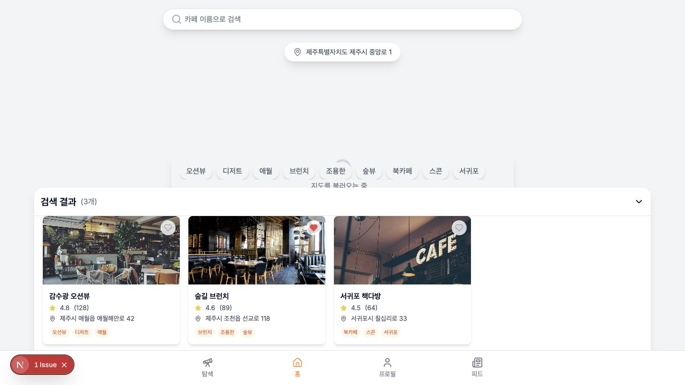
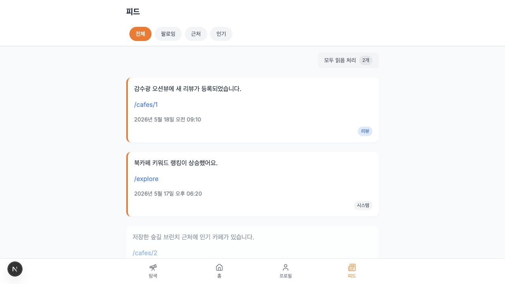

# 카페 감수광 Frontend

제주 카페를 검색하고, 위치와 취향 기반으로 추천받을 수 있는 카페 탐색 서비스의 프론트엔드입니다.

사용자는 지도에서 주변 카페를 훑어보고, 키워드 랭킹과 테마 추천으로 취향에 맞는 카페를 발견한 뒤, 상세 모달에서 리뷰와 메뉴, 길찾기까지 한 흐름으로 확인할 수 있습니다.

## 서비스 데모
https://github.com/user-attachments/assets/a6908096-1586-42ac-a541-1533ac30db99

> 영상이 보이지 않는 환경에서는 [service-demo.mp4](./docs/assets/service-demo.mp4)를 직접 열어 확인할 수 있습니다.

## 주요 화면

| 홈: 지도와 검색 | 탐색: 테마 추천 |
| --- | --- |
|  |  |

| 카페 상세 | 피드 |
| --- | --- |
|  |  |

## 서비스가 해결하려는 문제

제주에는 매력적인 카페가 많지만, 사용자가 원하는 분위기와 현재 위치에 맞는 장소를 빠르게 고르기는 쉽지 않습니다. 카페 감수광은 리뷰와 위치, 키워드를 함께 사용해 사용자가 "지금 가고 싶은 카페"를 더 짧은 탐색 과정으로 찾도록 돕습니다.

## 핵심 사용자 흐름

```text
로그인
  ↓
홈에서 지도/검색으로 주변 카페 확인
  ↓
탐색 탭에서 인기 키워드와 테마별 추천 탐색
  ↓
카페 상세 모달에서 리뷰, 메뉴, 길찾기 확인
  ↓
북마크/피드/프로필에서 개인화된 정보 관리
```

## 주요 기능

| 구분 | 기능 |
| --- | --- |
| 홈 | 카카오맵 기반 카페 위치 표시, 검색어 기반 카페 검색, 키워드 필터 |
| 탐색 | 인기 키워드 랭킹, 맞춤 추천, 테마별 추천, 근처 카페 조회 |
| 상세 | 카페 이미지, 평점, 주소, 키워드, 메뉴, 리뷰, 길찾기, 북마크 |
| 인증 | 이메일 로그인/회원가입, 카카오/네이버/구글 OAuth 진입점 |
| 마이페이지 | 프로필 조회/수정, 북마크, 내가 작성한 리뷰 |
| 피드 | 사용자 알림 피드, 읽음 처리, 필터 탭 |

## 기술 스택

| 영역 | 기술 |
| --- | --- |
| Framework | Next.js 15, React 19, TypeScript |
| Styling | Tailwind CSS, shadcn/ui, Radix UI |
| State | React Context, Custom Hooks |
| Data Fetching | Axios, Fetch API |
| Map | Kakao Maps JavaScript SDK |
| UI/UX | lucide-react, mobile-first responsive layout |

## 화면 구성

```text
app/
├── page.tsx                 # 홈: 지도, 검색, 추천 리스트
├── explore/page.tsx         # 탐색: 랭킹, 맞춤 추천, 테마, 근처 카페
├── feed/page.tsx            # 피드
├── login/page.tsx           # 로그인
├── signup/page.tsx          # 회원가입
├── profile/page.tsx         # 프로필
├── profile/edit/page.tsx    # 프로필 수정
├── profile/bookmarks        # 북마크
└── profile/reviews          # 내가 작성한 리뷰
```

## 폴더 구조

```text
cafe-gamsugwang-fe/
├── app/                 # Next.js App Router 페이지
├── components/          # 재사용 UI 및 도메인 컴포넌트
├── components/ui/       # shadcn/ui 기반 공통 컴포넌트
├── contexts/            # 인증, 위치, 추천, 장소 상태 관리
├── hooks/               # API 호출 및 화면 로직 훅
├── lib/                 # axios 인스턴스, 유틸 함수
├── public/              # 정적 이미지
└── types/               # Place, Review 등 타입 정의
```

## 구현 포인트

### 지도와 리스트를 함께 사용하는 홈 화면

홈 화면은 검색창, 현재 위치, 지도, 추천 카페 리스트를 한 화면에 배치했습니다. 사용자는 지도에서 위치 맥락을 확인하고, 하단 리스트에서 카페 상세 정보를 바로 열 수 있습니다.

### 추천 흐름 분리

추천 기능은 성격별로 Context와 커스텀 훅을 분리했습니다.

| Context | 역할 |
| --- | --- |
| `SelfRecommendContext` | 사용자 취향 기반 추천 |
| `KeywordRecommendContext` | 선택 키워드 기반 추천 |
| `LocationRecommendContext` | 위치 기반 추천 |
| `KeywordRankContext` | 인기 키워드 랭킹 |

이 구조 덕분에 탐색 탭의 각 화면은 API 호출 방식이 달라도 동일한 카드 UI로 결과를 보여줄 수 있습니다.

### 상세 모달 중심의 탐색 경험

카페 카드를 누르면 페이지 전환 없이 상세 모달을 띄웁니다. 리뷰, 메뉴, 길찾기, 북마크를 한 흐름에서 처리해 모바일 환경에서 탐색이 끊기지 않도록 구성했습니다.

### 인증 상태 기반 라우팅

`AuthContext`에서 access token 존재 여부를 기준으로 인증 상태를 관리합니다. 보호가 필요한 경로는 비로그인 상태에서 로그인 페이지로 이동하도록 처리했습니다.

## API 연동

| 기능 | API |
| --- | --- |
| 로그인 | `POST /api/v1/auth/login` |
| 카페 검색 | `GET /api/v2/cafes/search` |
| 자동완성 | `GET /api/v1/cafes/auto-complete` |
| 카페 상세 | `GET /api/v1/cafes/{cafeId}` |
| 맞춤 추천 | `GET /api/v2/cafes/self-recommend` |
| 키워드 추천 | `GET /api/v1/cafes/recommend?option=keyword` |
| 위치 추천 | `GET /api/v2/cafes/recommend?option=location` |
| 피드 | `GET /api/v1/feeds` |
| 프로필 | `GET /api/v1/users/profile` |

## 실행 방법

### 1. 의존성 설치

현재 패키지 조합에서 `react-day-picker`와 `date-fns` peer dependency 충돌이 발생할 수 있어, 로컬 실행 시 아래 명령을 권장합니다.

```bash
npm install --legacy-peer-deps
```

### 2. 환경변수 설정

프로젝트 루트에 `.env.local`을 생성합니다.

```env
NEXT_PUBLIC_API_HOST=http://localhost:8080
NEXT_PUBLIC_KAKAO_MAP_API_KEY=your_kakao_map_key

NEXT_PUBLIC_KAKAO_REST_API_KEY=your_kakao_rest_key
NEXT_PUBLIC_KAKAO_REDIRECT_URI=http://localhost:3000/oauth/kakao

NEXT_PUBLIC_NAVER_REST_API_KEY=your_naver_client_id
NEXT_PUBLIC_NAVER_REDIRECT_URI=http://localhost:3000/oauth/naver

NEXT_PUBLIC_GOOGLE_REST_API_KEY=your_google_client_id
NEXT_PUBLIC_GOOGLE_REDIRECT_URI=http://localhost:3000/oauth/google
```

### 3. 개발 서버 실행

```bash
npm run dev
```

브라우저에서 `http://localhost:3000`으로 접속합니다.

## 트러블슈팅

### 카카오맵이 계속 로딩 중일 때

`NEXT_PUBLIC_KAKAO_MAP_API_KEY`가 비어 있거나, 카카오 개발자 콘솔에 등록된 도메인에 `localhost:3000`이 포함되어 있지 않으면 지도가 정상 로드되지 않습니다.

### 로그인 후 API가 401을 반환할 때

브라우저 localStorage의 `accessToken`, `refreshToken` 값을 확인합니다. refresh token이 없거나 만료된 경우 로그인 페이지로 이동합니다.

### npm install 충돌

`date-fns@4`와 일부 UI 패키지의 peer dependency 범위가 맞지 않아 설치가 실패할 수 있습니다.

```bash
npm install --legacy-peer-deps
```

## 회고

이 프로젝트에서는 지도, 위치, 추천, 인증처럼 상태 변화가 많은 기능을 한 화면 흐름 안에 묶는 경험을 했습니다. 특히 API 호출을 화면 안에 직접 두지 않고 Context와 훅으로 분리하면서, UI는 사용자 흐름에 집중하고 데이터 로직은 재사용 가능한 단위로 관리하는 구조를 연습했습니다.
